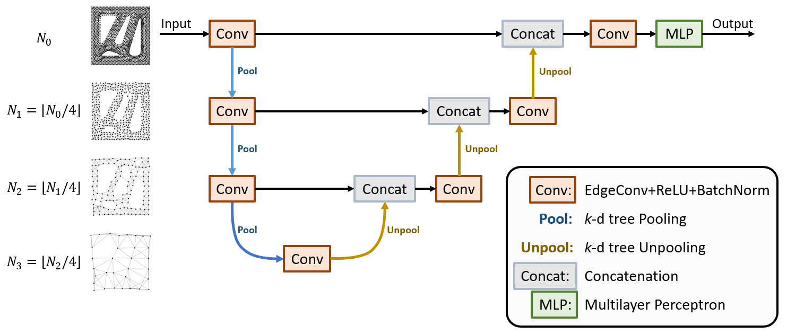

# Topology-Agnostic Graph U-Nets for Scalar Field Prediction on Unstructured Meshes



#### Authors
_Kevin Ferguson_, Carnegie Mellon University  
Yu-hsuan Chen, Carnegie Mellon University
Yiming Chen, Carnegie Mellon University
James Hardin, Air Force Research Lab  
Andrew Gillman, Air Force Research Lab  
Levent Burak Kara, Carnegie Mellon University  

Funded by Air Force Research Laboratory contract FA8650-21-F-5803.


## Paper Abstract

[Paper Link](https://asmedigitalcollection.asme.org/mechanicaldesign/article/147/4/041701/1207430/Topology-Agnostic-Graph-U-Nets-for-Scalar-Field)

Machine-learned surrogate models to accelerate lengthy computer simulations are becoming increasingly important as engineers look to streamline the product design cycle. In many cases, these approaches offer the ability to predict relevant quantities throughout a geometry, but place constraints on the form of the input data. In a world of diverse data types, a preferred approach would not restrict the input to a particular structure. In this paper, we propose Topology-Agnostic Graph U-Net (TAG U-Net), a graph convolutional network that can be trained to input any mesh or graph structure and output a prediction of a target scalar field at each node. The model constructs coarsened versions of each input graph and performs a set of convolution and pooling operations to predict the node-wise outputs on the original graph. By training on a diverse set of shapes, the model can make strong predictions, even for shapes unlike those seen during training. A 3-D additive manufacturing dataset is presented, containing Laser Powder Bed Fusion simulation results for thousands of parts. The model is demonstrated on this dataset, and it performs well, predicting both 2-D and 3-D scalar fields with a median $R^2 > 0.85$ on test geometries. 


## Citation

Consider citing the following:  

- Ferguson, K., Chen, Y., Chen, Y., Gillman, A., Hardin, J., and Burak Kara, L. (November 18, 2024). "Topology-Agnostic Graph U-Nets for Scalar Field Prediction on Unstructured Meshes." ASME. J. Mech. Des. April 2025; 147(4): 041701. https://doi.org/10.1115/1.4066960

BibTex:
```
@article{10.1115/1.4066960,
    author = {Ferguson, Kevin and Chen, Yu-hsuan and Chen, Yiming and Gillman, Andrew and Hardin, James and Burak Kara, Levent},
    title = {Topology-Agnostic Graph U-Nets for Scalar Field Prediction on Unstructured Meshes},
    journal = {Journal of Mechanical Design}, volume = {147}, number = {4},
    pages = {041701},
    year = {2024}, month = {11},
    issn = {1050-0472},
    doi = {10.1115/1.4066960},
    url = {https://doi.org/10.1115/1.4066960},
    eprint = {https://asmedigitalcollection.asme.org/mechanicaldesign/article-pdf/147/4/041701/7406492/md\_147\_4\_041701.pdf},
}
```


## Dataset
The dataset is currently available via this [Google Drive link](https://drive.google.com/file/d/1cWVClc2hmC7Zvb24OqYGH0fYzAzErq1a/view?usp=sharing).  

Instructions for how to use it are [here](3d/README.md).


## Usage

PyTorch and PyTorch Geometric are required.
Set up a Python virtual environment that has the necessary requirements with the following:
```
cd graph-field-prediction
python -m venv ./
source ./bin/activate
pip3 install torch torchvision torchaudio --index-url https://download.pytorch.org/whl/cu118
pip install pyg-lib torch-scatter torch-sparse torch-cluster torch-spline-conv torch-geometric -f https://data.pyg.org/whl/torch-1.13.0+cu116.html
```

- The [2d/](2d/) folder contains code for training models on the 2-D stress prediction dataset.
- The [3d/](3d/) folder contains code for training models on the 3-D Additive Manufacturing z-displacement prediction dataset.